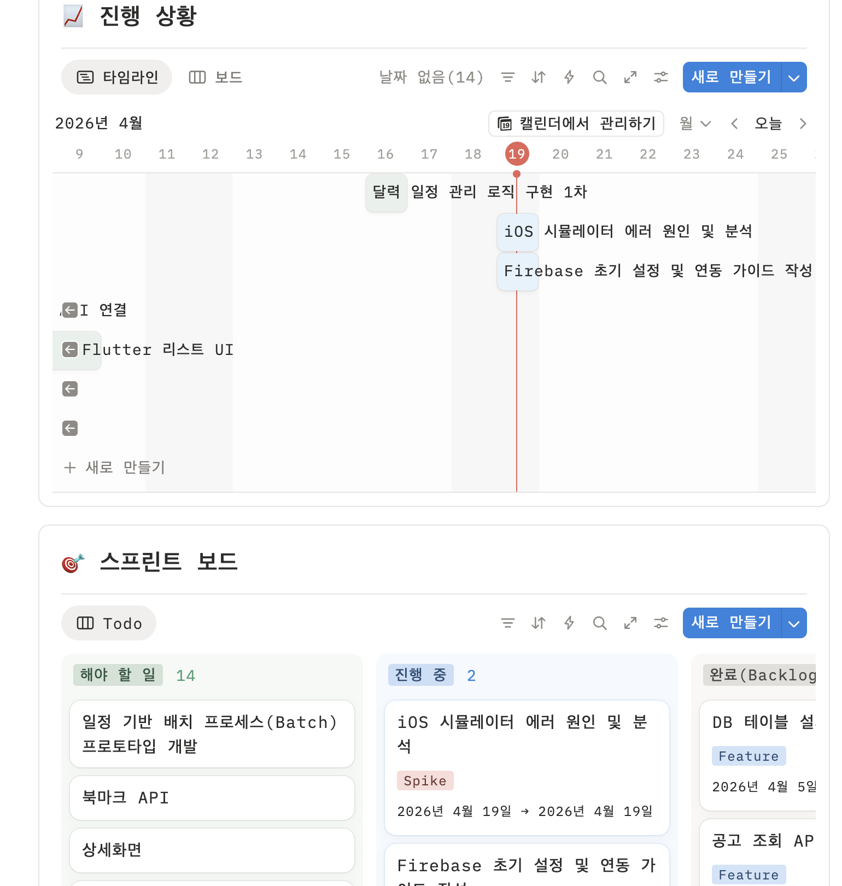

# 📅 Weekly Report (2026.05.10)

### 🎙️ 발표 및 진행
- 이번 주 발표는 없었음.

### 💬 Q&A 및 기술 토론
- 이번 주는 별도의 Q&A 및 기술 토론 없었음.

### 📚 학습 내용

#### 💻 Brew
- 클로드 활용에서 -> 코덱스 활용으로 변경

#### 💻 GU
- 이번 주는 참여하지 못함

#### 💻 Haribo
- Firebase 인증 환경 조사
- iOS 시뮬레이터 에러 원인 및 분석
- 학습 이미지 공유

#### 💻 Thing-i
- 이번 주는 참여하지 못함

### 🛠 운영 피드백
- 시작 전 1분 토크 본격 진행 (9시 시작)
- 스터디 시작/종료 시점 캡처(기록 추가)는 브루가 꾸준한 캡처 필요

### 📝 다음 주 준비사항
  1. **시작 전 1분 토크:** 스터디 시작 전 음성 채널에서 '오늘의 학습 계획'을 1분 내외로 짧게 공유하며 동기 부여
  2. **기록 추가:** 스터디 시작/종료 시점에 디스코드 음성 채널에 표시되는 시간과 인원을 캡처하여 **GitHub에 기록**
  3. **결과물 중심 인증:** 종료 시점에 각자 당일 학습한 코드·메모·레퍼런스 등을 1장의 이미지 공유